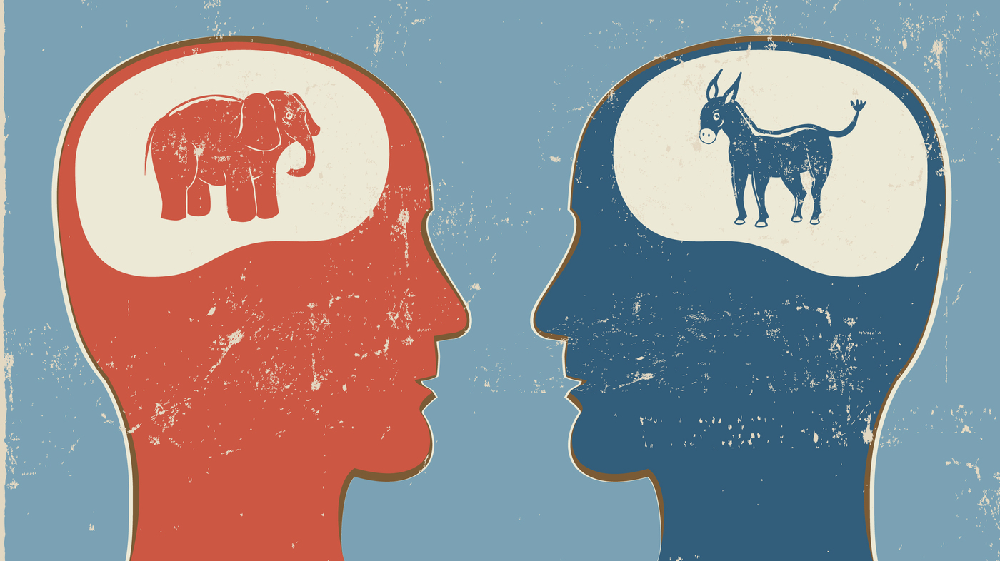

Congress2Vec
----
** info **  

    Dasha Zmachynskaya    : dasharya@gmail.com
    12/14/16

----

Table of Contents
----
- [I. Data Cleaning & Preprocessing](https://github.com/zmachynspider/Congress2Vec/blob/master/I.%20Data%20Cleaning%20%26%20Preprocessing.ipynb)
- [II. Exploratory Analysis](https://github.com/zmachynspider/Congress2Vec/blob/master/II.%20EDA.ipynb)
- [III. Model Building](https://github.com/zmachynspider/Congress2Vec/blob/master/III.%20Model%20Building.ipynb)
- [IV. Congress2Vec](https://github.com/zmachynspider/Congress2Vec/blob/master/IV.%20Congress2Vec.ipynb)

----
Motivation
----

Congress has become notorious for political stalemate and ineffectual legislation. The growing [partisan divide](http://www.theatlantic.com/magazine/archive/2016/07/how-american-politics-went-insane/485570/) is widely cited as the source of the issue, where hyper-partisanship and ideological orthodoxy is rewarded and compromise is chastised. 

The focus of this project is to apply natural language processing tools to evaluate congressional language to assess whether the very nature of the language of the parties differs, if so how, and by how much. 

----
Data
----

My data comes from the [Congressional Record](https://www.gpo.gov/fdsys/browse/collection.action?collectionCode=CREC), published online by the U.S. Government Publishing Office. The data is stored in a shelf file and is available for download [here](https://drive.google.com/open?id=0BzrocLjA1Z2tQXJVTUpuNWtmc1E). It contains: 
*"remarks made by senators and representatives while they are on the floor of the Senate and the House of Representatives. It also includes all bills, resolutions, and motions proposed, as well as debates and roll call votes"*. 

The data is contains remarks on the floor from 2002-2012. For the sake of manageablity of running this data locally, I analyzed speeches for the 112th Congress(2011-2012). Part I of the analysis focuses on cleaning and translating data from the shelf file to a pandas dataframe (*gov_doc_df.pkl in the data folder*). 

---
Modeling
---

I found that the text that I tagged as 'protocol' were essentially junk in my dataset. These sentences are virtually identical and follow the recipe: "Congress has the power to (lists a series of powers that can be leveraged by Congress)". For the sake of this analysis, I ignored these sentences and often removed them from EDA, since they often added noise to detecting actual variation between Congress members, as they did not reflect their natural speech. 

---
Further Extensions
---

In training word2vec, we see in the modelling section that word2vec still underperformed versus traditional vectorizers. I suspect that with more computational resources, I would be able to train the model on the full corpus and potentially get a vectorizer that could outperform TFIDF.

In addition, I would have liked to include more features in my model such as sentiment. Given more time, I would have added these features to see how much it could improve performance.
